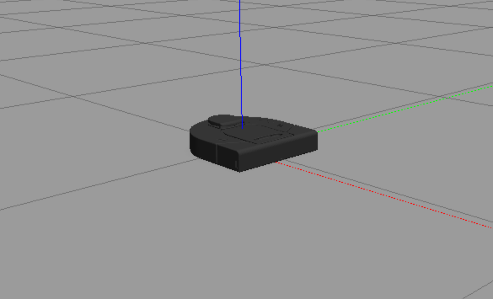
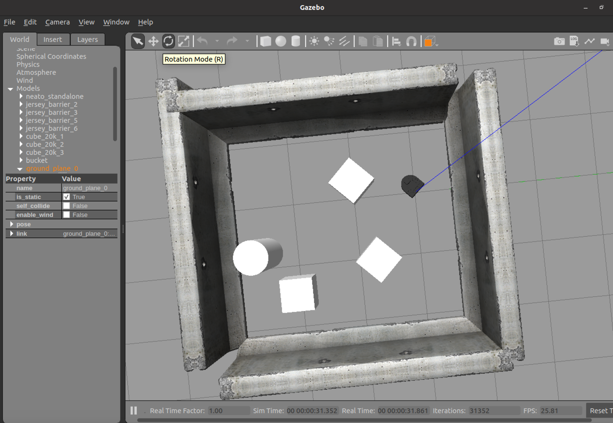
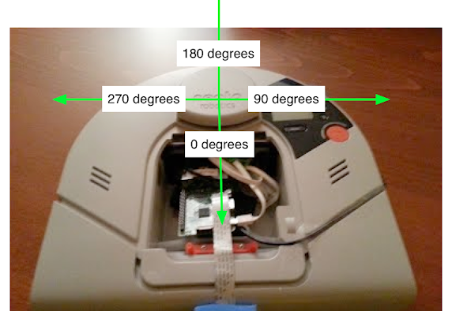

## Purpose of this How-to

This document will help you run the Neato simulator.  Before going through these instructions, make sure that you have already [setup your computing environment](setup_your_environment).

## What is a Simualtor?

TODO

## The Neato Simulator

<p align="center">

</p>

We will be using the popular Gazebo software for robot simulation.  Gazebo is a very powerful and customizable simulator that will be especially useful in this online (virtual) version of the course.

## Starting the Simulator

<ol>
<li>Start <tt>roscore</tt>

<p>Got to a terminal and run the following command.</p>


$ roscore

<p>You should see output that look like the following.</p>


... logging to /home/pruvolo/.ros/log/5e5e9c82-e17e-11ea-bd40-4997ac5b185e/roslaunch-ubuntu-114522.log
Checking log directory for disk usage. This may take a while.
Press Ctrl-C to interrupt
Done checking log file disk usage. Usage is <1GB.

started roslaunch server http://ubuntu:40119/
ros_comm version 1.15.8


SUMMARY
========

PARAMETERS
 * /rosdistro: noetic
 * /rosversion: 1.15.8

NODES

auto-starting new master
process[master]: started with pid [114559]
ROS_MASTER_URI=http://ubuntu:11311/

setting /run_id to 5e5e9c82-e17e-11ea-bd40-4997ac5b185e
process[rosout-1]: started with pid [114576]
started core service [/rosout]

</li>
<li>Launch Gazebo
<p>You can launch your robot in many different simulated worlds.  For instance, to launch your robot in a simulated obstacle course, you can run.</p>


$ roslaunch neato_gazebo neato_gauntlet.launch


<p>If all went well, you will see a bunch of output stream by and a visualization that looks like the following.</p>



<p>Instead if you want to run your Neato around the Olin dining hall, try the following command.</p>


$ roslaunch neato_gazebo neato_dh.launch


<p><i>Optional:</i> Loading the camera module. If you want to load a simulated video camera on your Neato, you can modify the instructions in the previous step.</p>


$ roslaunch neato_gazebo neato_dh.launch load_camera:=true


<p>This will result in a white box appearing over your Neato (the simulated camera).   You can look at the images using, e.g., <tt>rqt_gui</tt></p>

</li>
</ol>

## Available Topics

This documentation gives the high-level purpose of each topic.  To explore more, you can use the following command to get more information.

```bash
$ rostopic info topic-name
```

If you want to know more about a message you see in the output of ``rostopic`` you can use the following command (note that the ``-r`` flag can be ommitted if you want to the mesasges nested within the top-level message to be expanded).

```bash
$ rosmsg show msg_package_name/MessageName -r
```

### ``accel``

This is the linear acceleration of the Neato in meters per second squared along each axis of the Neato.  This same information is included in the ``imu`` topic (although there it is nested further).

### ``bump``

This rotopic contains four binary outputs corresponding to each of the Neato's four bump sensors.  In the simulator, all bump sensors are either on or off (no differentiation is made between the bump sensors).

### ``bumper``

This is an internal topic to Gazebo.  You can look at the output as you run into something if you are curious, but you don't need to worry about it in this class.

### ``clock``

This is the simulator clock.  This is useful for execcuting commands based on elapsed time.  It is preferable to use this clock rather than the wall clock (your computer's system clock) since the simulation might not run at the same rate as realtime.  You don't typically want to subscribe to this topic directly.  Instead, you can access the time through ``rospy`` (see the [ROS tutorials page](http://wiki.ros.org/rospy/Overview/Time) for details).

### ``cmd_vel``

You publish to this topic to set the robot's velocity.  The linear.x direction sets forward velocity and ``angular.z`` sets the angular velcoity.

### ``encoders``

These tell you the linear travel of each wheel (left is the first element of the array and right is the second) since the simulation started.  You do not have to subscribe to this directly, but instead you can use the ``odom`` topic or the ``tf`` module if you are you are just interested in knowing an estimate of where the robot is relative to where it started.

### ``gazebo/link_states``

This is a Gazebo specific topic (see the [Gazebo docs on ROS communication](http://gazebosim.org/tutorials/?tut=ros_comm)). 

### ``gazebo/model_states``

This is a Gazebo specific topic (see the [Gazebo docs on ROS communication](http://gazebosim.org/tutorials/?tut=ros_comm)). 

### ``gazebo/parameter_descriptions``

This is a Gazebo specific topic (see the [Gazebo docs on ROS communication](http://gazebosim.org/tutorials/?tut=ros_comm)). 

### ``gazebo/parameter_updates``

This is a Gazebo specific topic (see the [Gazebo docs on ROS communication](http://gazebosim.org/tutorials/?tut=ros_comm)). 

### ``gazebo/set_link_state``

This is a Gazebo specific topic (see the [Gazebo docs on ROS communication](http://gazebosim.org/tutorials/?tut=ros_comm)). 

### ``gazebo/set_model_state``

This is a Gazebo specific topic (see the [Gazebo docs on ROS communication](http://gazebosim.org/tutorials/?tut=ros_comm)). 

### ``imu``

This is the simulated IMU (intertial measurement unit).  It has linear acceleration and angular velocity.

### ``joint_states``

These tell you the total rotation (in radians) of each wheel.  Note that this is a "ground truth" value, meaning that it is not estimated from sensors but instead comes from Gazebo.  In a scenario with a real robot, you wouldn't have access to this.

### ``odom``

This tells you the robot's position relative to its starting location as estimated by wheel encoders.  You can get this inforation more flexibly through the ROS tf module, but this is a relatively easy way to get started.

### ``projected_stable_scan``

This provides the LIDAR measusrements (think of these as detected obstsacles or objects from the environment).  In contrast to the ``scan`` topics, these measurements are in the odometry frame (rather than relative to the robot) and are in Caretesian rather than polar coordinates.  There is no need to use this topic, but for some applications it is nice to have.

### ``raw_vel``

you publish to this topic set the left and right wheel velocities independently (rather than setting linear and angular velocities).  You can use this is ``cmd_vel`` for controlling the robot, whichever is easier.

### ``rosout``

This is a topic provided by ROS.  See the [ROS docs on ``rosout``](http://wiki.ros.org/rosout)for more information.

### ``rosout_agg``

This is a topic provided by ROS.  See the [ROS docs on ``rosout``](http://wiki.ros.org/rosout)for more information.

### ``scan``

These are the measurements of the Neato's LIDAR.  This diagram should help you with the project. It shows the angles for the laser range data coming from the Neato and how it maps onto the Neato's physical layout.

<p align="center">

</p>

The LaserScan message consists of a number of attributes:

```bash
$ rosmsg show sensor_msgs/LaserScan
std_msgs/Header header
  uint32 seq
  time stamp
  string frame_id
float32 angle_min
float32 angle_max
float32 angle_increment
float32 time_increment
float32 scan_time
float32 range_min
float32 range_max
float32[] ranges
float32[] intensities
```

Most of these attributes you can ignore for the purposes of this assignment. The one that you will really need to dig into is ranges. The ranges attribute provides 361 numbers where each number corresponds to the distance to the closest obstacle as detected by the laser scan at various angles relative to the robot. Each measurement is spaced exactly 1 degree apart. The first measurement corresponds to 0 degrees in the image of the Neato above. As the degrees in the image go up, so to does the index in the ranges array. Where does 361 come from? The last measurement (index 360) is the same as the first (index 0). Why do we do this craziness?!? We have to do this to adhere to some ROS conventions around LaserScan data that will be important later in the class. For now, you can safely ignore the last measurement (index 360).

### ``stable_scan``

This gives the same data as ``scan`` except the timestamp is automatically adjusted to keep the detected points stable in the odometry frame.  This topic is really only need with the physical Neato robot where the precise timing of the LIDAR is not available due to hardware limitations.

### ``tf``

This is provided by the [ROS tf2 module](http://wiki.ros.org/tf2) to update the relationhsip between various coordinate systems.  Typically you don't subscribe to it directly but instead use the Python tf module.

### ``tf_static``

This is provided by the [ROS tf2 module](http://wiki.ros.org/tf2) to update the relationhsip between various coordinate systems.  Typically you don't subscribe to it directly but instead use the Python tf module.

## Using Rviz with the Simulator

Once the simulator is running, to start rviz, run the following command.

```bash
$ rosrun rviz rviz
```

Once you get to rviz, the warmup project has some good instructionns for how to see the robot and its LIDAR.

1. Set the base_frame to "odom"
2. Add a visualization of the Neato's stabilized laser scan (topic /scan).  This is most easily found by using the "By topic" tab.  Make sure to adjust the size of the markers so you can see them easily).
3. Add a visualization of the Neato itself (this can be done by selecting "Robot Model" from the insert menu")
4. Add a visualization of the Neato's camera feed (topic camera/image_raw) (this only applies if you launched the simulation with ``load_camera:=true``)


## Shuting Down the Simulator

Go to the terrminal where you executed **step 2** (launch Gazebo) and hit control-c.
