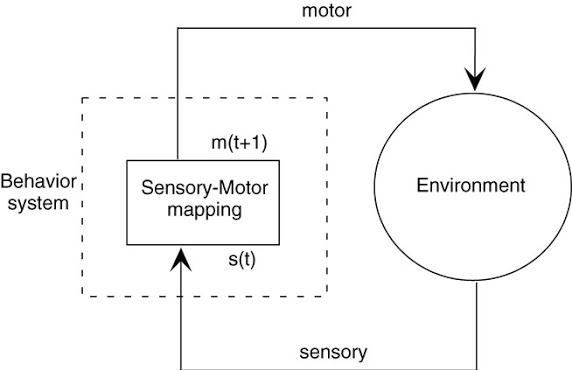
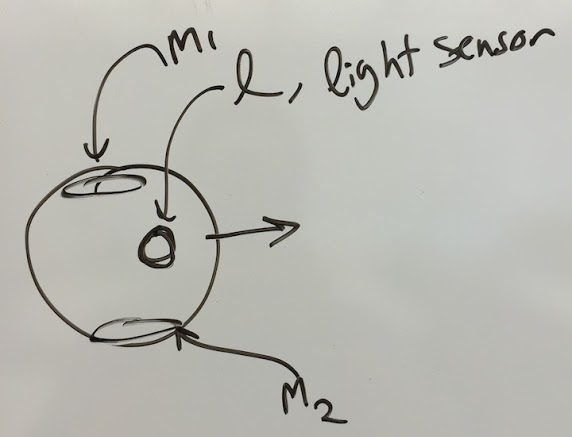
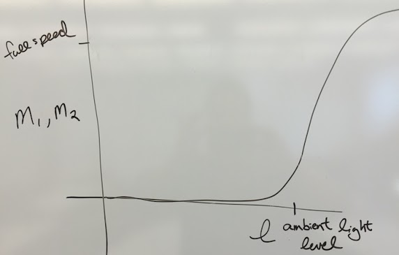

## Today
* Intro to CompRobo! (slides: pptx, pdf)
* Robot Tortoises and Braitenberg Vehicles

## For Next Time
* Fill out course entrance survey
* Get your environment setup
* Read Ch. 1 and 2 of "A Gentle Introduction to ROS" (AGIR).  The first chapter has some good background on the motivation behind ROS and what it is and is not.  The beginning of Chapter 2 through 2.2 you can skip (it has outdated installation instructions).  The rest of chapter 2 is a really nice intro to the basics of topics and nodes.
* Once you have read chapter 2 of AGIR, connect to a Neato.  What topics are published?  Which nodes are running?  Which nodes subscribe to which topics?  Come to class with questions about the Neato's architecture (e.g. what do all the topics mean?, what are all the nodes for?, etc.).
* Start working on the Warmup Project

## Sensory-Motor Loops

In our view, at their very core robots are about sensory-motor loops.  We can visualize this relationship in the following way.

This feedback loop can cause very simple sensory-motor mappings to exhibit complex behavior.  In fact, you will be amazed at the capabilities of some of the very first robots.  Meet the Neato's predecessor! (apologies for the antiquated language)

<iframe width="560" height="315"
src="https://www.youtube.com/embed/lLULRlmXkKo"
frameborder="0" 
allow="accelerometer; autoplay; encrypted-media; gyroscope; picture-in-picture" 
allowfullscreen></iframe>

The pioneering work of Grey Walter was followed up by a number of others.  One particularly interesting work was by Valentino Braitenberg.  Valentino Braitenberg was interested in how very simple sensory-motor loops could elicit behaviors that when viewed by humans would evoke emotion and feelings of intelligence and intentionality (on the part of the robot).  The name typically used to refer to these hypothetical robots is "Braitenberg Vehicles".  While Braitenberg never actually built these robots (he was more interested in how these simple robots might inform various philosophical issues, particularly in the philosophy of mind), others have followed up and actually built these robots.

Here is a video from a group at MIT that built several of Braitenberg's vehicles.

<iframe width="560" height="315"
src="https://www.youtube.com/embed/VWeRC6j0fW4"
frameborder="0" 
allow="accelerometer; autoplay; encrypted-media; gyroscope; picture-in-picture" 
allowfullscreen></iframe>

## Base Robot

The robots in the video are quite simple.

**Motor system:** the robot moves using something called differential drive.  All this means is that when both wheels move in the same direction (either forwards or backwards), the robot moves in a straight line in the same direction (assuming the wheels move at roughly constant speed).  If the wheels move in opposite directions the robot will spin in place (which direction the robot spins depends on which wheel is moving forward and which is moving backward).

**Sensory system:** the robot has three different types of sensors:
* A whisker sensor that can tell when something is touching it (you can see that in the video under "insecure")
* A bump sensor that turns on when it runs into something
* A light sensor that emits higher values when in the presence of bright light and lower values when in darkness (you can think of this as very primitive single pixel camera!)

In teams of three we are going to design our first sensory-motor mappings, and by doing so we are going to effectively define our first robot programs.  However, instead of using a programming language we are going to write our programs graphically on (Zoom) whiteboards.

For instance, suppose we wanted to implement the behavior of the wary robot whose behavior mainly consists of moving forward until it encounters a shadow (and then stopping).  First, let's draw our robot and label it's motors and sensors:

We will use the symbol $$m_1$$ to refer to the left wheel (positive means the wheel is moving forward, negative is backwards, and 0 is stopped).  $$m_2$$ is similar to $$m_1$$ but for the right wheel.  the symbol $$l$$ refers to the value of a light sensor (the higher the value the more light detected).

In the case of robots whose behavior is purely based on their current sensor values, we can fully specify the robot's behavior by defining the sensory-motor mapping.  We know we want the robot to move at full speed in situations with a lot of light and stop in shadows.  In order to express this mapping, we can use a simple plot to show the relationship between the two motor outputs and the light sensor input.

This seems reasonable, but how can we build confidence that this is the correct mapping before we implement.  One way is to put the robot in a specific situation and to simulate the behavior that would be generated by the sensory-motor mapping above.  Next, I will show three key frames form a situation that help to build confidence that the mapping above is reasonable.

This seems reasonable, but how can we build confidence that this is the correct mapping before we implement.  One way is to put the robot in a specific situation and to simulate the behavior that would be generated by the sensory-motor mapping above.  Next, I will show three key frames form a situation that help to build confidence that the mapping above is reasonable.

TODO: image

First, the robot is in full light (a.l.l. stands for ambient light level) and thus the two motors are at roughly full speed.

TODO: image

Next, the robot has moved partially into the shadow (depicted with black lines) which causes the light sensor value to drop and the speed to drop to about half speed.

TODO: image

Finally, the robot is sufficiently into the shadow that it stops entirely.
At the whiteboards in groups of three, work through generating robot programs to realize the behaviors in the video. 
Questions to keep in mind while doing this activity
1. At least one of the behaviors cannot be reproduced without some very primitive form of memory (although perhaps if you are very creative it can work).  Which behaviors are these?  How can you tell? 
2. If you were to implement this in a real robot what strategies would you use to test whether your implementation worked?
3. In what interesting ways could the light sensor and the whisker sensor be combined in a single video?  What would the resultant behavior of this vehicle be?  What would you call your new vehicle?

## Adding Memory

The robot has the ability to remember a very small amount of information.   The robot has access to a single flag that starts out with the value 0.  Its value can be toggled from 0 to 1 or from 1 to 0 when a particular event occurs.  For instance, if the light sensor reads a certain value, the robot might toggle its flag.  The value of the flag can then inform the behavior of the robot. Given this new capability, implement any behaviors in the video that you couldn't before.  To represent this graphically, create two sets of graphs that map light levels to motor commands.  Draw a state diagram that shows the conditions under which the robot transitions between one set of behaviors and another.

TODO: picture

## Implement a New Behavior

Choose a new behavior for your robot.  Feel free to reposition the light sensor and the bump sensors.  Make sure to draw a diagram of your robot.  Sketch out some key frames of your robot's behavior and specify the sensory-motor mappings (and state diagram if applicable).  If you'd like, you may add additional light sensors before doing this (see next section).

We'll do a quick report out on the behavior your team implemented to the rest of the class.

## Adding More Sensors

Consider adding an additional light sensor to your robot.  Now that you have two light sensors, you can get the robot to do a richer set of behaviors.  Sketch the configuration of sensors on your new Braitenberg vehicle (equipped with two light sensors).  Try to reproduce behaviors such as light seeking and light avoiding.  For more ideas see the Wikipedia page on Braitenberg vehicles.

## Design Your Own Vehicle in Simulation

Try out this fantastic simulator for Braitenberg vehicles to see if you can make interesting patterns and better understand how they work.

## Additional resources

* Braitenberg creatures (this paper describes the LEGO robot in the video embedded above).
* Social Integration of Robots into Groups of Cockroaches to Control Self-organized Choices cool paper showing robots influencing actual cockroach collective behavior!
* For even more crazy ideas for sensory-motor loops, checkout the Wikipedia page on BEAM robotics.
